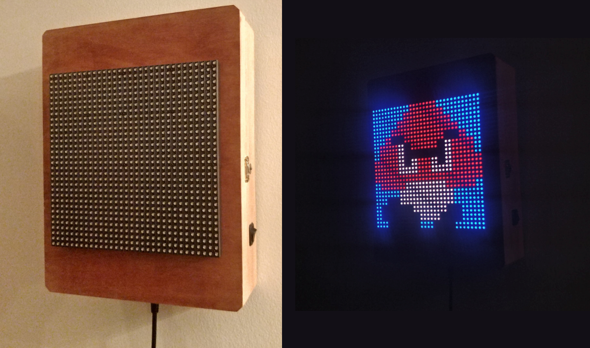
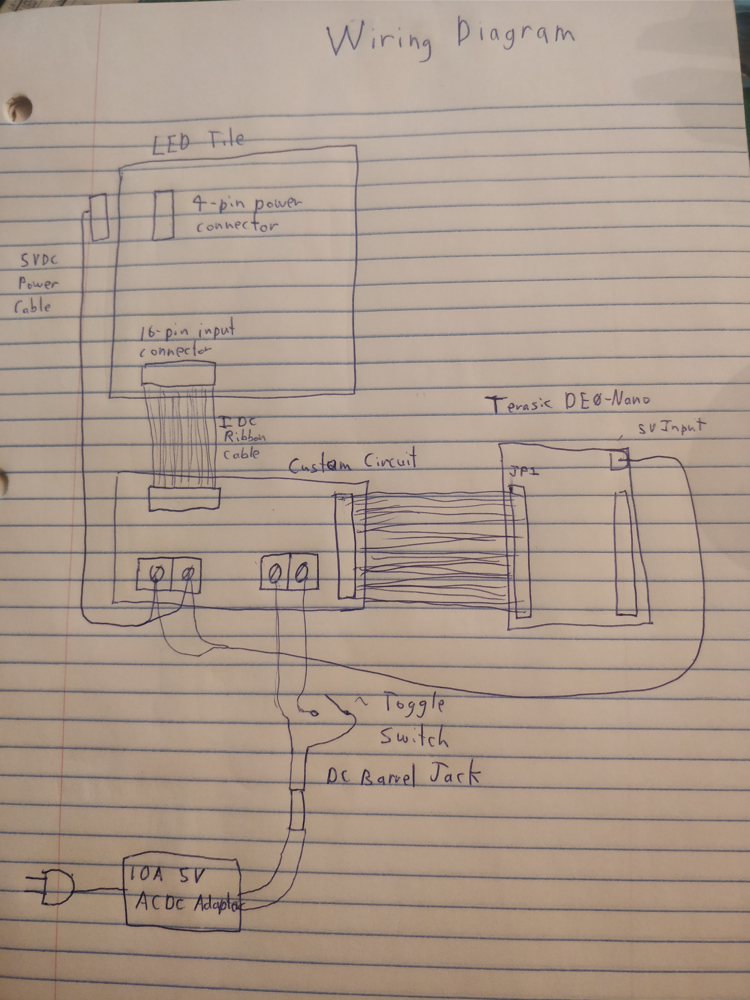

# LEDTile

A 32x32 LED tile that I hung up on my wall.  Uses a Terasic DE0-Nano FPGA with a Nios II core soft CPU and a custom circuitboard.

### Prerequisites

* Quartus Prime 16.1 Lite Edition
* A Terasic DE0-Nano FPGA or something like it
* My circuit or something else to power the board and FPGA and connect them together

### Components

* The DE0-Nano board
  * Logic for pushing a memory pixel buffer to the tile
  * Nios II core CPU for graphics into the pixel buffer
* My custom circuit board the provides a place to hook up the FPGA and LED tile to, and supplies power
* Cables
* On/Off Switch
* 5V DC power jack

The are connected as shown: 

### About the Terasic DE0-Nano

Of interest to this project, the board contains...

* Altera Cyclone IV EP4CE22F17C6N
* 32MB SDRAM
* 64Mb EPCS64 serial configuration device
* 50 MHz oscillator
* 72 IO pins
* On-board USB Blaster circuit

### Bootup

The Nios II processor reset address is set to the base address of the EPCS controller in Qsys. At reset, a boot copier program runs on the Nios II from on chip ram, the program skips the FPGA configuration in the EPCS device, then reads the data following it into the SDRAM, then jumps to the start of the program.  The boot copier is put there by Quartus.
