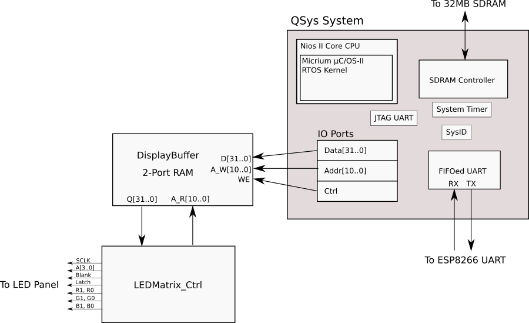

# LEDTile

This is an FPGA-driven WiFi connected 32x32 LED tile that I hang on my wall.  Uses a Terasic DE0-Nano FPGA with a Nios II core soft CPU, a custom circuitboard, and an ESP8266 serving an HTTP API for controlling it.  

New ESP8266 firmware can be done over the air, but the FPGA configuration and Nios II are loaded over a USB cable.


# Prerequisites

* Quartus Prime 17.1 Lite Edition
* A Terasic DE0-Nano FPGA or something like it
* My circuit or something else to power the board and FPGA and connect them together
* PlatformIO to build the ESP8266 firmware

# Components

* The DE0-Nano board
  * Logic for pushing a memory pixel buffer to the tile and managing the timing of the R, G, and B LED components to create the illusion of colour mixing
  * Nios II core CPU for transferring graphics into the pixel buffer
* My custom circuit board the provides a place to hook up the FPGA and LED tile to, and supplies power
* ESP8266 WiFi SoC serving an HTTP API for control of the unit
* Cables
* On/Off Switch
* 5V DC power jack

They are connected as shown: 


The insides in detail look like:


### About the Terasic DE0-Nano FPGA Board

Of interest to this project, the board contains...

* Altera Cyclone IV EP4CE22F17C6N
* 32MB SDRAM
* 64Mb EPCS64 serial configuration device
* 50 MHz oscillator
* 72 IO pins
* On-board USB Blaster circuit

Here is a high level diagram of the logic implemented in the FPGA:


# Building

## FPGA Configuration
LEDTile.qpf is the Quartus project file and should be opened in Quartus. It can be build and converted into a programming file then loaded into the serial configuration device over USB.

## Nios II Software
Open the Eclipse tools for Nios II and create a new workspace, and add all of the projects in
/software to it.

The Board Support Package will likely need to be regenerated.  Right click LEDTile_BSP2 then go Nios II->Generate BSP

Build LEDTileApplication and write it to the serial configuration device using the Flash Programmer under the NIOS II menu.

## ESP8266 Software
This is a Platform IO project built in Visual Studio Code. It can be uploaded by a USB-Serial cable to the board or over WiFi if first loaded with the ESP8266 WiFi loader and configured with the access details for an access point.

# What Happens on Bootup
The FPGA loads its configuration from the EPCS configuration device.  This includes the Nios II soft core CPU and the FPGA logic that reads from a display buffer to update pixels on the display.

The Nios II processor reset address is set to the base address of the EPCS controller in Qsys. At reset, a boot copier program runs on the Nios II from on chip ram, the program skips the FPGA configuration in the EPCS device, then reads the data following it into the SDRAM, then jumps to the start of the program.  The boot copier is put there by Quartus.


# HTTP API

The device should be available under LEDPanel.local, thanks to bonjour/zeroconf.

## Set Pixel

Set a single pixel to an RGB value as specified by a JSON object

* **URL**
/setPixel

* **Method**
`POST`

* **Data Params**

```
{"x": 1,
"y": 1,
"r": 0,
"g": 0,
"b": 255}
```

* **Success Response**
  * **Code** 200
  * **Content** A congradulatory string

* **URL**
/setImage

* **Method**
`POST`

* **Data Params**

1024 * 3 bytes encoded as Base 64. One 3-tuple of RGB values per pixel in the display. R1G1B1R2G2B2...R1024G1024B1024

```
{
  image_base64="c2RmYXNmYXNz......(much longer)"
}
```